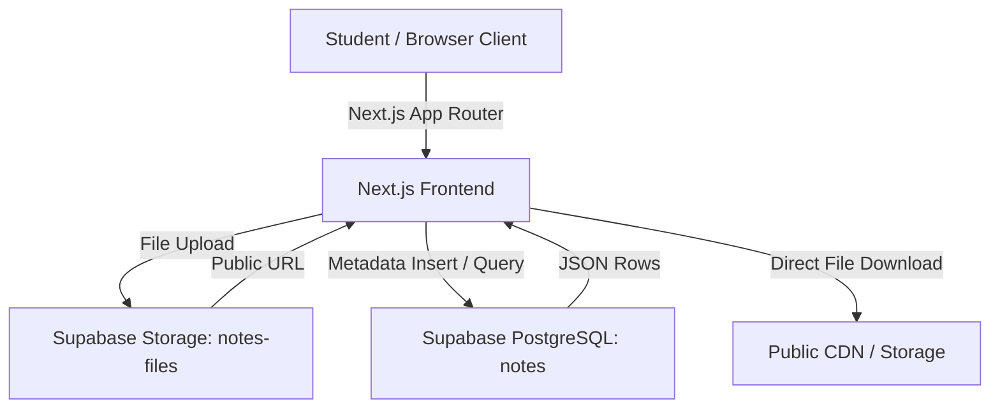

# Campus Notes Hub — Code & Architecture Walkthrough

This document provides a technical walkthrough of the architecture, key files, and design choices in **Campus Notes Hub**. It is structured as a guide for code reviews and presentation demos.

---

## 1. System Architecture Overview



### Architectural Highlights
1. **Serverless & Jamstack Architecture:**
   - Next.js acts as both the rendering layer (Server Components & Client Components) and application host on Vercel.
   - Supabase replaces traditional Node/Express server boilerplate by exposing typed REST APIs and Storage directly to the client SDK.
2. **Decoupled File Storage & Metadata:**
   - Heavy binary files (PDFs, images) are offloaded to **Supabase Storage** (`notes-files` bucket).
   - High-performance relational metadata is stored in **PostgreSQL** (`notes` table) with indexing and full constraint validation.
3. **No-Auth Open Contribution Model (Deliberate MVP Design):**
   - In accordance with the PRD 1-hour sprint scope, student uploads require no login barriers.
   - Uploader identity is captured via free-text attribution, lowering friction to maximize resource sharing.

---

## 2. Key File Tour

### 1. `src/lib/supabase.ts` — Database Client & Domain Types
- **Purpose:** Centralized Supabase client initialization and TypeScript domain contract.
- **Key Code:**
  ```typescript
  export interface Note {
    id: string;
    title: string;
    description: string | null;
    department: string;
    semester: number;
    subject: string;
    uploader_name: string;
    file_url: string;
    file_type: 'pdf' | 'image';
    created_at: string;
  }
  export const supabase = createClient(supabaseUrl, supabaseAnonKey);
  ```
- **Why It Matters:** Gives end-to-end type safety across all React components and queries.

---

### 2. `src/app/upload/page.tsx` — Two-Step Upload Pipeline
- **Purpose:** Uploads the physical note file and persists note metadata atomically.
- **Pipeline Flow:**
  1. **Client Validation:** Checks required fields, restricts file formats (`.pdf`, `.png`, `.jpg`, `.jpeg`, `.webp`), and sanitizes filenames.
  2. **Storage Upload:**
     ```typescript
     const { error: storageError } = await supabase.storage
       .from("notes-files")
       .upload(storageFilePath, file, { cacheControl: "3600", upsert: false });
     ```
  3. **Public URL Extraction:**
     ```typescript
     const { data } = supabase.storage.from("notes-files").getPublicUrl(storageFilePath);
     ```
  4. **Relational Insert:**
     ```typescript
     const { data, error } = await supabase.from("notes").insert([{ ...metadata, file_url }]);
     ```
  5. **Auto-Redirect:** Transitions user smoothly to `/browse` upon success.

---

### 3. `src/app/browse/page.tsx` — Real-Time Search & Multi-Faceted Filtering
- **Purpose:** The core discovery engine of the application.
- **Key Capabilities:**
  - **Free-Text Search:** Employs PostgreSQL `ilike` pattern matching across three fields simultaneously (`title.ilike.%term%,subject.ilike.%term%,description.ilike.%term%`).
  - **Dynamic Aggregation:** Aggregates unique subjects dynamically from existing database records.
  - **Combinable Filters:** Department, semester, and subject filters can be applied together in any combination.
  - **Debouncing:** Uses a 250ms debounce with React `useTransition` to prevent UI stutter while searching.

---

### 4. `src/app/notes/[id]/page.tsx` — Note Detail View & Document Viewer
- **Purpose:** Deep-linkable individual note page.
- **Key Features:**
  - Displays full metadata (Subject, Department, Semester, Uploader Name, Formatted Date).
  - In-browser preview: embedded PDF reader card for PDF documents or high-resolution responsive image viewer for handwritten scans.
  - Direct download button linking directly to the CDN `file_url`.

---

### 5. `src/components/NoteCard.tsx` — Responsive Resource Card
- **Purpose:** Modular card view used across the Home Page and Browse Page.
- **Features:**
  - Visual badges for Semester and File Type.
  - Line-clamped titles and descriptions to prevent irregular card heights.
  - Direct quick-download action and detail view navigation.

---

### 6. `src/components/Navbar.tsx` & `src/app/layout.tsx` — Layout & Navigation
- **Purpose:** Universal navigation bar, brand identity, and mobile responsive header.
- **Key Features:**
  - Responsive header adapting from ~375px mobile screens up to wide desktops.
  - Clean font pairing using Google Geist fonts.

---

## 3. Design Decisions & Trade-offs

| Decision | Alternative Considered | Rationale |
|---|---|---|
| **Supabase SDK directly in Next.js** | Custom Express / Fastify server | Avoided a separate service to deploy, monitor, and configure. Kept the stack lean and reliable. |
| **Public Storage Bucket** | Signed private URLs with token expiration | Study notes are public educational resources; public URLs eliminate token refreshing overhead and simplify direct downloads. |
| **No Authentication in v1** | Auth0 / Supabase Auth | PRD explicitly scoped v1 for zero-barrier sharing. Auth is deferred to future backlog iterations to prevent deadline overrun. |
| **Tailwind CSS Utility Classes** | Styled Components / CSS Modules | Avoided runtime CSS overhead, provided built-in responsive breakpoints, and guaranteed zero CSS specificity conflicts. |

---

## 4. Presentation & Demo Script (2-Minute Walkthrough)

1. **Introduction (15s):**
   > *"Welcome to Campus Notes Hub. Every semester, students lose hours chasing down notes scattered across WhatsApp chats and broken Drive links. We built Campus Notes Hub to give students a fast, organized, and centralized repository for study materials."*

2. **The Upload Flow (30s):**
   > *"Let's upload a new resource. Anyone can share notes in seconds without an account. We fill in the title, select Department and Semester, enter the subject and our name, and drop in a PDF or image. The file goes directly to Supabase Storage, and the metadata lands in PostgreSQL with instant confirmation."*

3. **Browse & Search (45s):**
   > *"Now let's jump into Browse Notes. Here you see all uploaded resources. Notice how fast search is: if I type 'data structures' or even a concept keyword from the description like 'Butterworth', it filters instantly. We can combine this with Semester 3 and CSE department filters to pinpoint exact exam material."*

4. **Detail & Download (20s):**
   > *"Clicking on any note opens its dedicated detail page with complete contributor info, an in-browser preview, and a direct one-click download button."*

5. **Conclusion & Roadmap (10s):**
   > *"Campus Notes Hub is live, fully responsive, and ready for campus use. Future enhancements will add student accounts, ratings, and course bookmarks. Thank you!"*